# Waze descriptives and pre-period diagnostics

Date: 2026-09-17. Phase C. No post-opening treatment effect has been estimated.

## Reproduction and fixed conventions

From the repository root run `Rscript Scripts/Congestion/02_prepare_blocks.R` once, then `Rscript Scripts/Congestion/02_descriptives.R` and `Rscript Scripts/Congestion/02_report.R`. The last command launches the independent audit in a fresh R session. For a new audit after regeneration, run `02_audit_descriptives.R` explicitly and then `02_report.R` again. Only the preparation script reads the raw Parquet. It verifies unique keys, writes the distinct all_roadtype and large blocks to Data/Waze/parquet/, and preserves raw_multiplicity as provenance. Repeated preparation reuses the files. The CSV is not read again. All subsequent Waze reads use those two blocks; the validated Phase B spatial metadata and original GPKG layers supply geography.

All congestion series use all_roadtype. Morning means bins 7 and 8, evening 17 and 18, and night 0 through 4. Peak pools the four morning/evening bins with equal weights. There is no day-of-week field, so weekends remain in every block. Each retained cell receives equal weight in each month. The all-road/fast-road support comparison is a diagnostic of two separately filtered blocks, never their sum. large means free-flow speed above 50 km/h, not an arterial road class.

The completed panel sets absent records to zero for primary TCI, severe TCI and TCS metres, but never imputes jam speed or free flow. Exact -998/-999 sentinels become NA. Neither a missing flag_corr_type nor missing user/jam counts can be reconstructed. Jam speed first averages available hourly records within each cell, then gives equal weight to cells with a defined average; its changing support appears below. It is conditional on recorded congestion, not an unconditional speed outcome. Free flow appears only as a diagnostic, not as a fifth outcome.

Every cell has NA outcomes in February, March and April 2025. No line or average fills the gap. Usable P2 consists of January and May-December 2025, nine months. P1 remains December 2023-August 2024; disruption remains all of September-December 2024. Time-series plots mark the opening and shade disruption grey and the delivery gap amber. Pre-only panels explicitly end before these dates; maps, scatterplots and hour profiles have no calendar axis to shade.

## Fixed population and donor coverage

The no-pre column includes never-observed cells; the observed-but-no-pre column counts the additional exclusion after dropping never-observed cells. Eligibility is fixed for every month. Pre coverage divides delivered all-road hour slots by all 23 months from January 2022 through November 2023, counting absent slots as zero. Saturated donors require at least 20 slots per month; threshold 12 is a sensitivity option. This is profile availability, not a count of users or underlying hourly timestamps.

| group | grid_cells | never_observed | no_pre_including_never | observed_but_no_pre | retained | saturated20 | threshold12 |
| --- | --- | --- | --- | --- | --- | --- | --- |
| REST | 2365.0000 | 740.0000 | 832.0000 | 92.0000 | 1533.0000 | 271.0000 | 555.0000 |
| RING | 56.0000 | 0.0000 | 0.0000 | 0.0000 | 56.0000 | 0.0000 | 0.0000 |
| CORRIDOR | 34.0000 | 0.0000 | 0.0000 | 0.0000 | 34.0000 | 0.0000 | 0.0000 |
| CENTER | 7.0000 | 0.0000 | 0.0000 | 0.0000 | 7.0000 | 0.0000 | 0.0000 |
| BELISARIO | 7.0000 | 0.0000 | 0.0000 | 0.0000 | 7.0000 | 0.0000 | 0.0000 |

All 740 never-observed cells lie in REST. A further 92 observed REST cells have no pre-period record. The resulting population contains 1637 cells, including 1533 REST cells and 271 saturated donors; threshold 12 retains 555 REST cells. No monitor-neighborhood, CORRIDOR or RING cell is lost.

CENTER and BELISARIO are the published-point seed plus six H3 neighbors. Coordinates rounded to 0.01 degrees do not establish the true monitor cell. This replaces the requested single-cell series until precise coordinates arrive. Remaining cells within 1 km of any station form CORRIDOR; those within 2 km form RING; the rest form REST. Neighborhoods take priority. Distances use delivered centroids. MetroStations.gpkg supplies stations, MetroLine.gpkg the alignment, and Distancia_REMMAQ_Metro.gpkg the rounded monitor points, all copied from the air-quality repository. The original San Francisco buffer remains an alternative, not the adopted CENTER geometry.

| group | grid_id | eligible |
| --- | --- | --- |
| CENTER | 8866d33881fffff | TRUE |
| CENTER | 8866d33885fffff | TRUE |
| CENTER | 8866d33887fffff | TRUE |
| CENTER | 8866d3388dfffff | TRUE |
| CENTER | 8866d338a9fffff | TRUE |
| CENTER | 8866d338abfffff | TRUE |
| BELISARIO | 8866d338c9fffff | TRUE |
| CENTER | 8866d338e3fffff | TRUE |
| BELISARIO | 8866d33aa1fffff | TRUE |
| BELISARIO | 8866d33aa3fffff | TRUE |
| BELISARIO | 8866d33aa7fffff | TRUE |
| BELISARIO | 8866d33aabfffff | TRUE |
| BELISARIO | 8866d33ab5fffff | TRUE |
| BELISARIO | 8866d33abdfffff | TRUE |

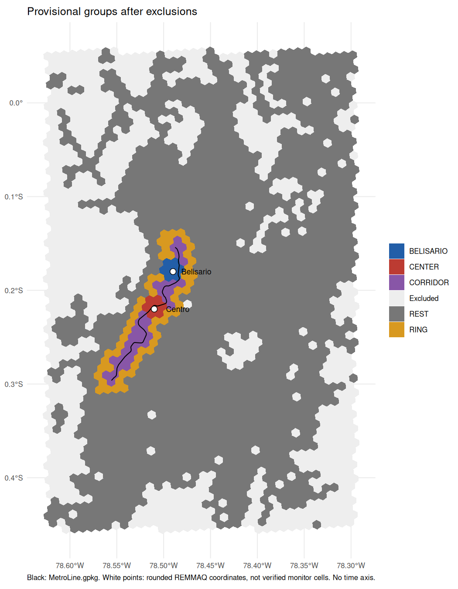

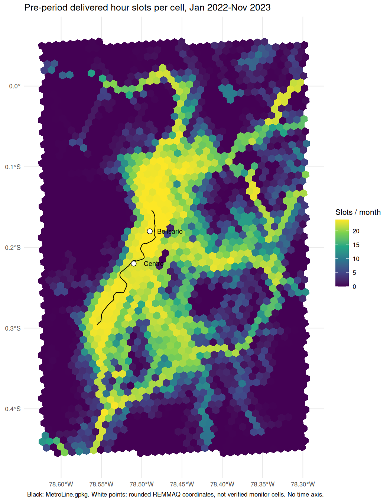

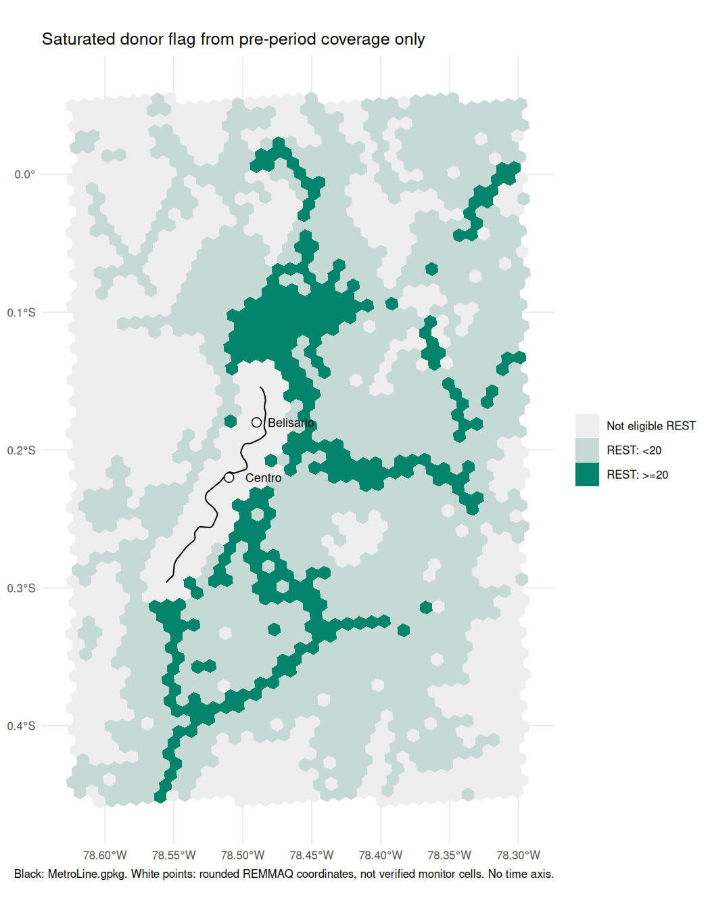

## Singleton-key concentration

The following single table compares the two cleaned blocks. Categories are cells, delivered months or hours. The top five percent means ceiling(0.05 times category count), ranked by singleton count, not selected by outcomes. Compare their share of singletons with their share of all keys. Singleton minima/maxima describe within-category proportions. Exact duplicates cannot be treated as independent observations or allowed to reweight groups.

| block | dimension | categories | singleton_keys | min_singleton_share | max_singleton_share | all_singleton_categories | no_singleton_categories | top5pct_categories | top5pct_singleton_share | top5pct_key_share | largest_category |
| --- | --- | --- | --- | --- | --- | --- | --- | --- | --- | --- | --- |
| all_roadtype | grid_id | 1729.0000 | 185385.0000 | 0.0000 | 1.0000 | 250.0000 | 1479.0000 | 87.0000 | 0.7530 | 0.1062 | 8866d33ac1fffff |
| all_roadtype | date | 83.0000 | 185385.0000 | 0.1371 | 0.1442 | 0.0000 | 0.0000 | 5.0000 | 0.0751 | 0.0745 | 202510 |
| all_roadtype | hour_of_day | 24.0000 | 185385.0000 | 0.1376 | 0.1428 | 0.0000 | 0.0000 | 2.0000 | 0.1058 | 0.1053 | 11 |
| large | grid_id | 1667.0000 | 120509.0000 | 0.0000 | 1.0000 | 236.0000 | 1431.0000 | 84.0000 | 0.8794 | 0.1244 | 8866d30491fffff |
| large | date | 83.0000 | 120509.0000 | 0.1318 | 0.1553 | 0.0000 | 0.0000 | 5.0000 | 0.0764 | 0.0766 | 202510 |
| large | hour_of_day | 24.0000 | 120509.0000 | 0.1358 | 0.1450 | 0.0000 | 0.0000 | 2.0000 | 0.1040 | 0.1017 | 11 |

Singletons concentrate entirely by cell, not by date or hour. All-road singleton cells have multiplicity one at every delivered key; the other cells have multiplicity three. Month and hour singleton shares stay near 14 percent. This is consistent with a spatial duplication mechanism, whose provenance remains unconfirmed. Deduplication removes the resulting geographic reweighting.

## Raw outcome trajectories and reporting proxies

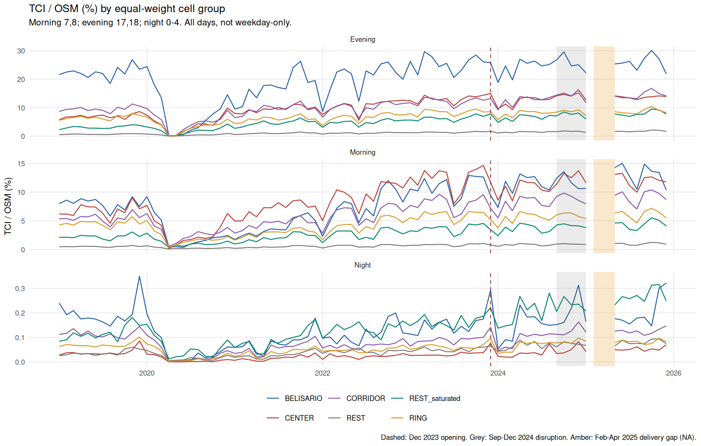

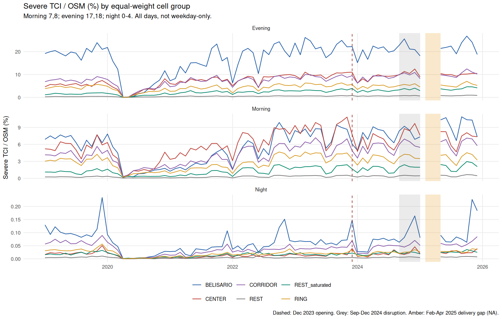

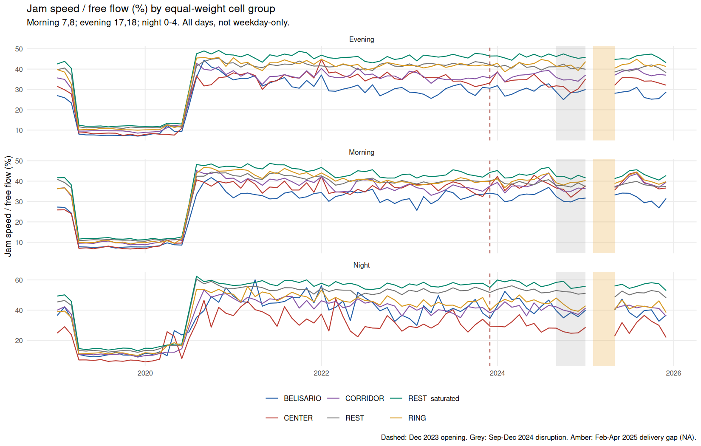

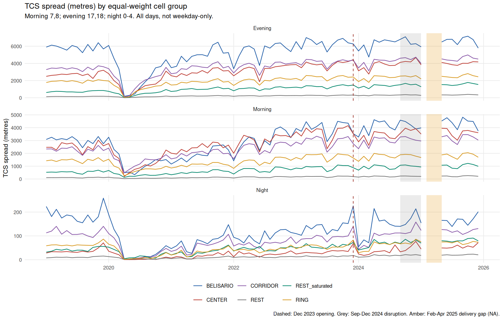

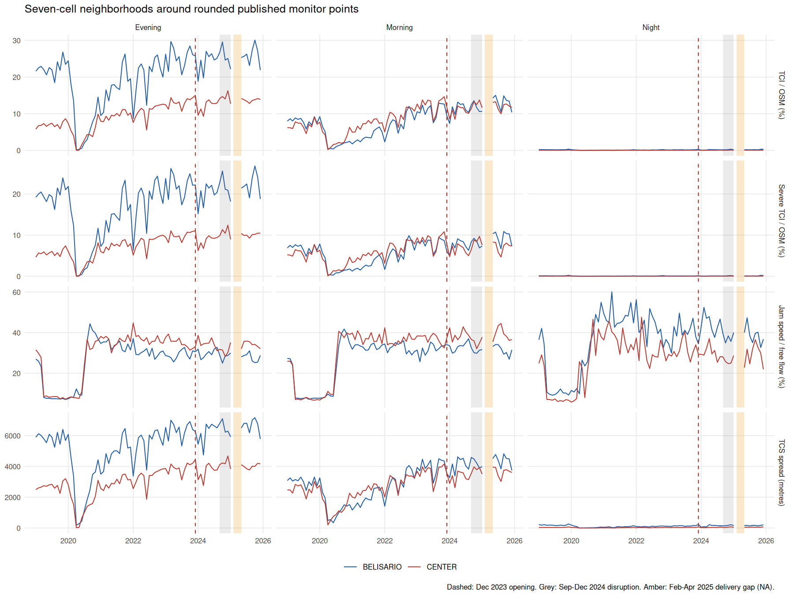

These panels are delivered/completed levels, not counterfactual comparisons. The two REST lines always use the same exclusions; the saturated line additionally applies the pre-only threshold. The next table gives equal-month descriptive levels. January-November 2023 deliberately excludes opening month. Usable 2025 excludes the entire delivery gap. Differences between rows must not be read as metro effects.

| series | period | TCI | presence | TCS_metres | conditional_TCI |
| --- | --- | --- | --- | --- | --- |
| BELISARIO | 2022 | 13.8791 | 1.0000 | 4216.3057 | 13.8791 |
| BELISARIO | Jan-Nov 2023 | 18.2527 | 1.0000 | 5199.2744 | 18.2527 |
| BELISARIO | Usable 2025 | 19.1393 | 1.0000 | 5446.6413 | 19.1393 |
| CENTER | 2022 | 10.0063 | 1.0000 | 3148.3899 | 10.0063 |
| CENTER | Jan-Nov 2023 | 12.7134 | 1.0000 | 3751.4196 | 12.7134 |
| CENTER | Usable 2025 | 12.8032 | 1.0000 | 3809.7044 | 12.8032 |
| CORRIDOR | 2022 | 8.1056 | 1.0000 | 3049.4971 | 8.1056 |
| CORRIDOR | Jan-Nov 2023 | 10.1221 | 1.0000 | 3556.7630 | 10.1221 |
| CORRIDOR | Usable 2025 | 11.6059 | 1.0000 | 3830.0630 | 11.6059 |
| REST | 2022 | 0.8493 | 0.4377 | 187.3977 | 1.9404 |
| REST | Jan-Nov 2023 | 1.0880 | 0.4529 | 232.4623 | 2.4026 |
| REST | Usable 2025 | 1.3591 | 0.5222 | 277.4601 | 2.6026 |
| REST_saturated | 2022 | 3.7733 | 0.9854 | 894.8721 | 3.8292 |
| REST_saturated | Jan-Nov 2023 | 4.9579 | 0.9784 | 1108.7779 | 5.0676 |
| REST_saturated | Usable 2025 | 6.0622 | 0.9782 | 1280.4523 | 6.1975 |
| RING | 2022 | 5.3988 | 0.9561 | 1681.7978 | 5.6466 |
| RING | Jan-Nov 2023 | 7.1625 | 0.9765 | 2070.0505 | 7.3351 |
| RING | Usable 2025 | 7.2995 | 0.9787 | 2151.3343 | 7.4586 |

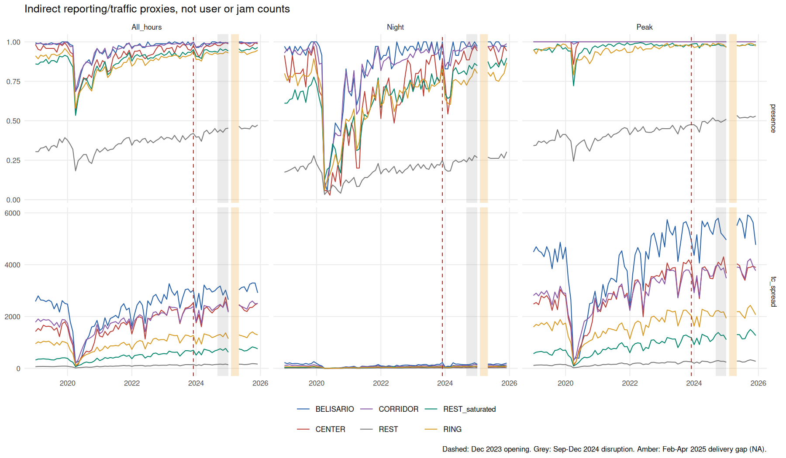

Actual observation and jam-event counts were not delivered. Presence records whether any monthly hour-profile row exists; TCS measures delivered spread in metres. Both combine traffic and Waze reporting. They cannot distinguish app penetration from genuine changes in congestion. CENTER is much more saturated than the broad REST pool, so a common penetration trend is not a defensible default.

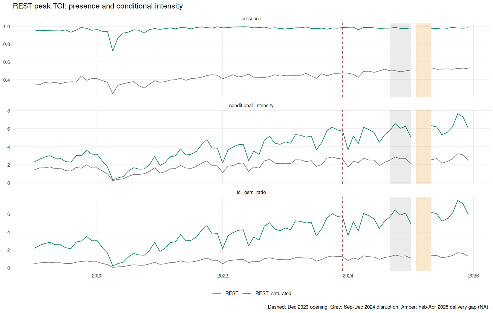

For primary TCI, the completed equal-cell/equal-hour average equals presence times intensity conditional on a record. Conditional intensity here pools recorded cell-hours, which is required for the identity; it is not an equal-cell average of conditional means. Both margins can move. The decomposition diagnoses the source of changes in the delivered series, not the cause of reporting or traffic changes. rest_decomposition.rds retains monthly morning, evening and combined-peak values for both REST populations.

In the broad REST pool, peak presence is 0.4377, 0.4529, 0.5222 in 2022, January-November 2023 and usable 2025, respectively; conditional TCI is 1.9404, 2.4026, 2.6026 percent. Both margins contribute to its rising delivered level. Saturated REST presence is 0.9854, 0.9784, 0.9782, while conditional TCI is 3.8292, 5.0676, 6.1975 percent. Its trajectory is therefore mainly an intensity change, not increasing record presence. Neither statement identifies traffic separately from changes in the provider's measurements.

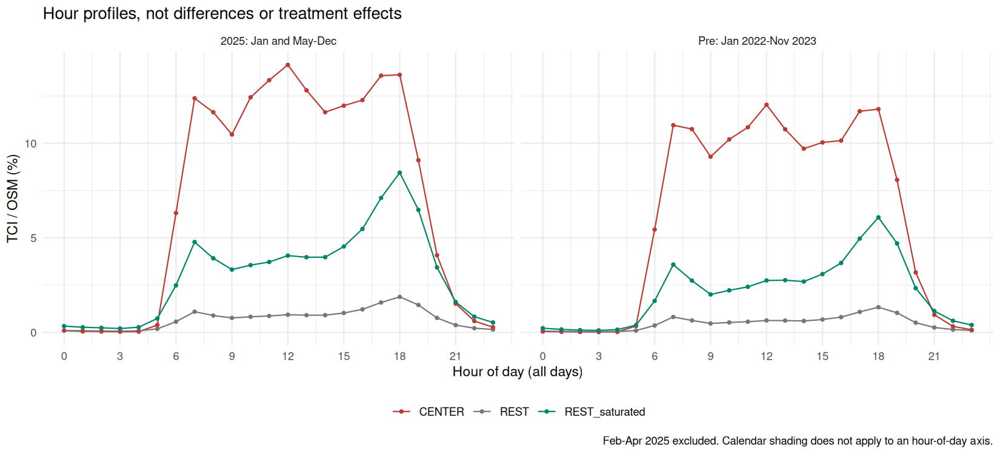

The pre profile pools January 2022-November 2023, not all of calendar 2023. The second panel pools only usable 2025 months. Both use equal cell-month weights. A different seasonal mix and missing weekday information limit interpretation. The profiles are not differenced and do not estimate a treatment effect.

## Free flow, composition and artifacts

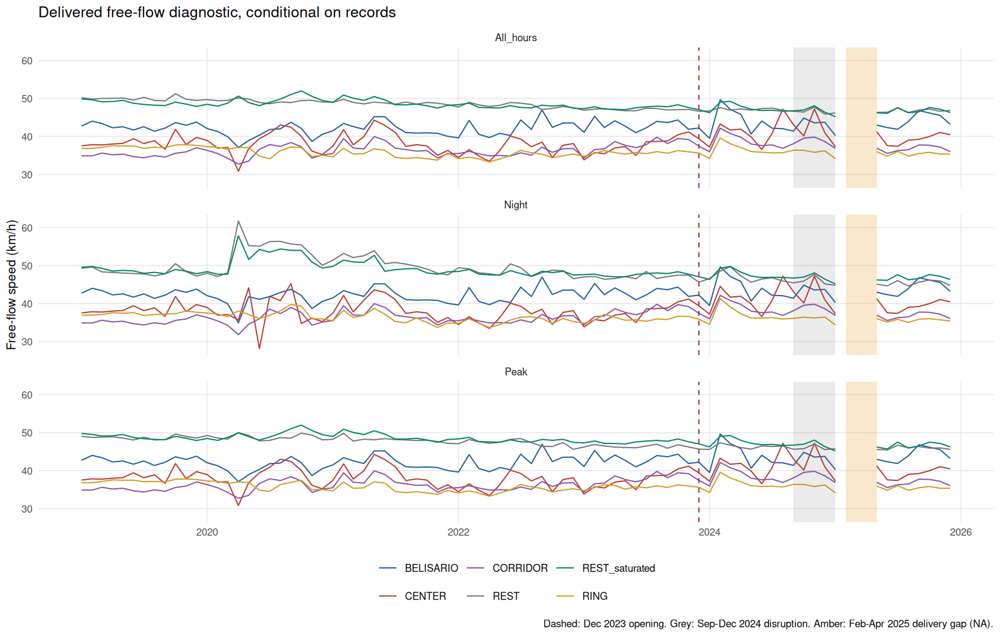

TCI/OSM divides by OSM road length and the provider's expected observation normalization, not by free-flow speed. Monthly free-flow estimation still affects jam detection, the severe threshold, speed ratios and speed-class membership. This plot conditions on delivered records and cannot hold the underlying segment mix fixed. The following levels bracket opening and disruption without estimating a break or attributing a change to either event.

| series | date | avg_freeflow |
| --- | --- | --- |
| BELISARIO | 202311.0000 | 41.8754 |
| BELISARIO | 202312.0000 | 42.2227 |
| BELISARIO | 202408.0000 | 42.0506 |
| BELISARIO | 202409.0000 | 41.3922 |
| CENTER | 202311.0000 | 41.1820 |
| CENTER | 202312.0000 | 39.4011 |
| CENTER | 202408.0000 | 47.1863 |
| CENTER | 202409.0000 | 43.0984 |
| CORRIDOR | 202311.0000 | 39.2051 |
| CORRIDOR | 202312.0000 | 37.4509 |
| CORRIDOR | 202408.0000 | 36.8828 |
| CORRIDOR | 202409.0000 | 38.0960 |
| REST | 202311.0000 | 47.1182 |
| REST | 202312.0000 | 46.6149 |
| REST | 202408.0000 | 46.8860 |
| REST | 202409.0000 | 46.6333 |
| REST_saturated | 202311.0000 | 47.6077 |
| REST_saturated | 202312.0000 | 47.0433 |
| REST_saturated | 202408.0000 | 46.6289 |
| REST_saturated | 202409.0000 | 46.7265 |
| RING | 202311.0000 | 35.9495 |
| RING | 202312.0000 | 35.6158 |
| RING | 202408.0000 | 35.7047 |
| RING | 202409.0000 | 36.3901 |

CENTER free flow is 41.1820, 39.4011, 47.1863, 43.0984 km/h in November 2023, December 2023, August 2024 and September 2024, respectively. Other comparators do not all move together, and CENTER is volatile well before opening. These are visible local discontinuities, not formal break tests. The figures do not support dismissing the monthly free-flow threat or claiming a unique metro-timed break.

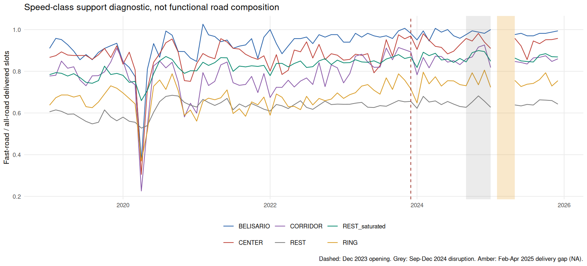

The fast/all support ratio describes available speed-class profiles. It is not a road-length share or a functional road composition measure. The two deduplicated blocks cannot reconstruct all six original class trajectories; Phase B retains their inventory. Monthly speed reclassification and reporting changes can both alter this proxy. Ask for fixed segment classes and denominators before using fast roads as a confirmatory restriction.

A new delivery inconsistency complicates this check: 8290 fast-road keys across 280 cells have no all_roadtype key at the same cell-month-hour. Consequently the fast/all support ratio can exceed one, as it does in Belisario in November 2023. This contradicts simple nesting of the delivered row supports. The descriptive all-road completion rule remains as instructed, but the provider must explain whether these missing all-road records really mean zero congestion.

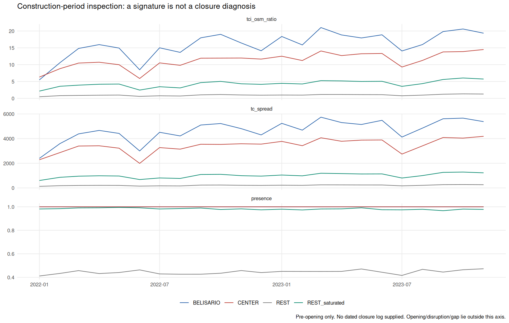

The full-period primary and proxy panels also document the pronounced 2020 trough and subsequent recovery. Construction-period plots show the delivered 2022-2023 trajectories only. No dated San Francisco/La Alameda closure or reopening log was supplied, so the series cannot establish which local movements reflect construction teardown. Keep that mechanism as unresolved, not as a verified artifact with an assigned date.

## Negative auxiliary spread-ratio rows

The distinct all-road block contains 2272 negative tc_spread_osm_ratio rows after excluding exact sentinels. 30 fall in the masked delivery gap. 2032 flagged rows have two usable adjacent calendar months on the retained population. The comparison uses the same cell and hour, completes genuinely absent neighboring records with zero, and requires both adjacent months. It does not substitute the nearest available month across a gap. The reference distribution comprises unflagged delivered rows with the same two-neighbor requirement; it is not matched on traffic level.

| bad_spread | rows | median_tci | median_adjacent | median_deviation | median_abs_deviation | p95_abs_deviation | median_scaled_abs | outside_adjacent_range |
| --- | --- | --- | --- | --- | --- | --- | --- | --- |
| TRUE | 2032.0000 | 2.1365 | 0.4035 | 1.2367 | 1.6066 | 6.7162 | 0.9156 | 0.7613 |
| FALSE | 1213085.0000 | 0.2357 | 0.1890 | 0.0159 | 0.1240 | 2.0004 | 0.0819 | 0.6476 |

| group | flagged_rows | retained_rows | saturated_rows |
| --- | --- | --- | --- |
| REST | 2272.0000 | 2217.0000 | 294.0000 |

| flagged_rows | flagged_median_scaled | same_cell_hour_reference_median | share_above_own_reference |
| --- | --- | --- | --- |
| 912.0000 | 0.9470 | 0.1973 | 0.8640 |

All flagged keys belong to REST. Among two-neighbor comparisons, their median primary TCI is 2.1365 percent versus an adjacent-month median of 0.4035; the median signed deviation is +1.2367 percentage points. Unflagged rows have a much smaller median deviation, +0.0159. The additional table compares scaled absolute deviations against unflagged months in the same cell-hour, reducing the concern that the global reference simply has lower congestion. These unusually elevated values look potentially contaminated; the comparison cannot establish whether the error lies in the primary field, the auxiliary field, or both. Treat this as a donor-quality threat rather than declaring the primary outcome clean.

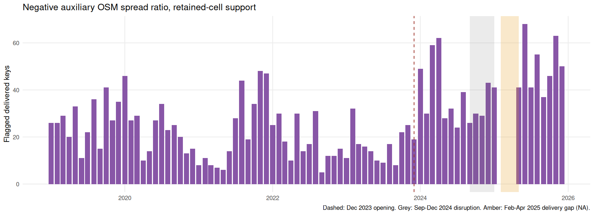

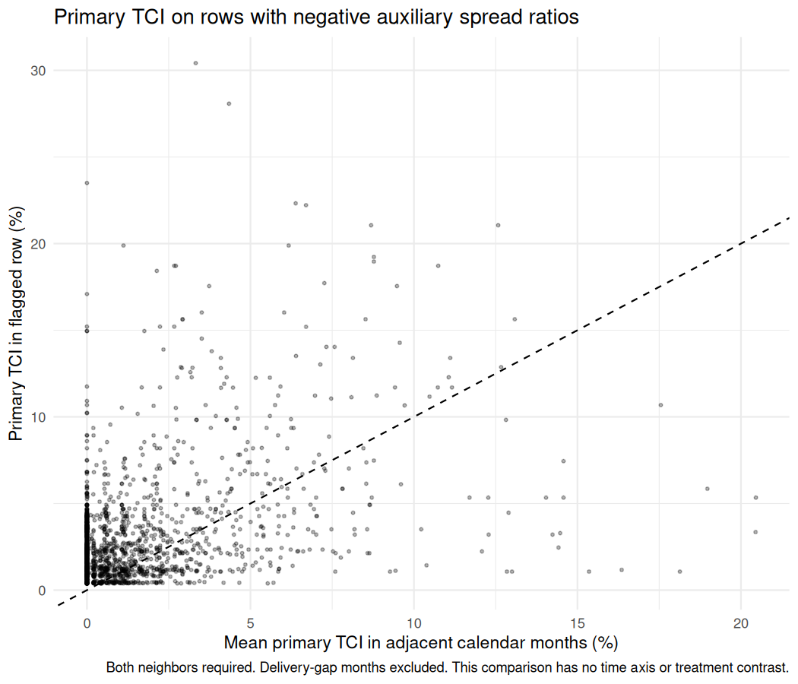

The original negative auxiliary field is not an analysis outcome. This diagnostic can reveal accompanying primary-TCI anomalies but cannot certify the primary numerator or OSM denominator. Keep the flagged keys in the primary descriptive series, label them, and ask the provider to trace the error before choosing a treatment-analysis exclusion rule. The complete flagged-row comparison is negative_spread_adjacent_months.rds.

## Pre-period summaries and donor diagnostics

The table describes equally weighted cell-month block averages from January 2022 through November 2023. SD is across cell-months, not a standard error. Zero-congestion share always means the share with primary TCI equal to zero, including for the conditional speed outcome; it does not mean zero vehicle speed. Defined cell-months records the different speed support. Ratio units are percentage points and TCS units are metres.

| series | block | outcome | mean | SD | zero_congestion_cell_month_share | defined_cell_months |
| --- | --- | --- | --- | --- | --- | --- |
| BELISARIO | Evening | tci_severe_osm_ratio | 20.0207 | 11.5847 | 0.0000 | 161.0000 |
| BELISARIO | Evening | avg_jam_speed_ratio | 29.7856 | 8.4628 | 0.0000 | 161.0000 |
| BELISARIO | Evening | tc_spread | 5890.8478 | 3152.8391 | 0.0000 | 161.0000 |
| BELISARIO | Evening | tci_osm_ratio | 22.7642 | 12.0737 | 0.0000 | 161.0000 |
| BELISARIO | Morning | tci_severe_osm_ratio | 6.9020 | 4.8114 | 0.0000 | 161.0000 |
| BELISARIO | Morning | avg_jam_speed_ratio | 32.1578 | 7.2307 | 0.0000 | 161.0000 |
| BELISARIO | Morning | tc_spread | 3481.9945 | 2162.2920 | 0.0000 | 161.0000 |
| BELISARIO | Morning | tci_osm_ratio | 9.1775 | 5.8703 | 0.0000 | 161.0000 |
| BELISARIO | Night | tci_severe_osm_ratio | 0.0633 | 0.0662 | 0.0000 | 161.0000 |
| BELISARIO | Night | avg_jam_speed_ratio | 41.4993 | 13.6215 | 0.0000 | 161.0000 |
| BELISARIO | Night | tc_spread | 114.1327 | 69.7763 | 0.0000 | 161.0000 |
| BELISARIO | Night | tci_osm_ratio | 0.1293 | 0.0980 | 0.0000 | 161.0000 |
| CENTER | Evening | tci_severe_osm_ratio | 8.9970 | 5.0230 | 0.0000 | 161.0000 |
| CENTER | Evening | avg_jam_speed_ratio | 36.1731 | 13.9791 | 0.0000 | 161.0000 |
| CENTER | Evening | tc_spread | 3570.4459 | 1604.6866 | 0.0000 | 161.0000 |
| CENTER | Evening | tci_osm_ratio | 11.7492 | 5.5320 | 0.0000 | 161.0000 |
| CENTER | Morning | tci_severe_osm_ratio | 7.8033 | 4.2191 | 0.0000 | 161.0000 |
| CENTER | Morning | avg_jam_speed_ratio | 36.6923 | 12.0150 | 0.0000 | 161.0000 |
| CENTER | Morning | tc_spread | 3303.1449 | 1519.9248 | 0.0000 | 161.0000 |
| CENTER | Morning | tci_osm_ratio | 10.8528 | 5.5064 | 0.0000 | 161.0000 |
| CENTER | Night | tci_severe_osm_ratio | 0.0133 | 0.0086 | 0.0000 | 161.0000 |
| CENTER | Night | avg_jam_speed_ratio | 31.3337 | 12.1551 | 0.0000 | 161.0000 |
| CENTER | Night | tc_spread | 27.2774 | 14.9505 | 0.0000 | 161.0000 |
| CENTER | Night | tci_osm_ratio | 0.0265 | 0.0152 | 0.0000 | 161.0000 |
| CORRIDOR | Evening | tci_severe_osm_ratio | 8.1925 | 5.8358 | 0.0000 | 782.0000 |
| CORRIDOR | Evening | avg_jam_speed_ratio | 36.4214 | 9.2511 | 0.0000 | 782.0000 |
| CORRIDOR | Evening | tc_spread | 3903.0121 | 2060.4188 | 0.0000 | 782.0000 |
| CORRIDOR | Evening | tci_osm_ratio | 11.0662 | 6.5138 | 0.0000 | 782.0000 |
| CORRIDOR | Morning | tci_severe_osm_ratio | 5.1382 | 4.4007 | 0.0000 | 782.0000 |
| CORRIDOR | Morning | avg_jam_speed_ratio | 36.9549 | 10.1647 | 0.0000 | 782.0000 |
| CORRIDOR | Morning | tc_spread | 2681.1929 | 1441.0343 | 0.0000 | 782.0000 |
| CORRIDOR | Morning | tci_osm_ratio | 7.0739 | 5.1878 | 0.0000 | 782.0000 |
| CORRIDOR | Night | tci_severe_osm_ratio | 0.0372 | 0.0365 | 0.0026 | 782.0000 |
| CORRIDOR | Night | avg_jam_speed_ratio | 41.8901 | 11.5195 | 0.0026 | 780.0000 |
| CORRIDOR | Night | tc_spread | 78.9131 | 60.3842 | 0.0026 | 782.0000 |
| CORRIDOR | Night | tci_osm_ratio | 0.0772 | 0.0652 | 0.0026 | 782.0000 |
| REST | Evening | tci_severe_osm_ratio | 0.5635 | 2.0206 | 0.4476 | 35259.0000 |
| REST | Evening | avg_jam_speed_ratio | 41.8235 | 15.7362 | 0.4476 | 19486.0000 |
| REST | Evening | tc_spread | 249.2474 | 652.5918 | 0.4476 | 35259.0000 |
| REST | Evening | tci_osm_ratio | 1.2055 | 3.5201 | 0.4476 | 35259.0000 |
| REST | Morning | tci_severe_osm_ratio | 0.3764 | 1.4610 | 0.5042 | 35259.0000 |
| REST | Morning | avg_jam_speed_ratio | 39.8649 | 15.7557 | 0.5042 | 17492.0000 |
| REST | Morning | tc_spread | 168.6533 | 484.5937 | 0.5042 | 35259.0000 |
| REST | Morning | tci_osm_ratio | 0.7215 | 2.3714 | 0.5042 | 35259.0000 |
| REST | Night | tci_severe_osm_ratio | 0.0047 | 0.0236 | 0.6509 | 35259.0000 |
| REST | Night | avg_jam_speed_ratio | 52.6133 | 18.6219 | 0.6509 | 12317.0000 |
| REST | Night | tc_spread | 12.3679 | 32.2334 | 0.6509 | 35259.0000 |
| REST | Night | tci_osm_ratio | 0.0460 | 0.1652 | 0.6509 | 35259.0000 |
| REST_saturated | Evening | tci_severe_osm_ratio | 2.7129 | 3.8914 | 0.0022 | 6233.0000 |
| REST_saturated | Evening | avg_jam_speed_ratio | 45.7748 | 15.1421 | 0.0022 | 6219.0000 |
| REST_saturated | Evening | tc_spread | 1189.8968 | 1103.6861 | 0.0022 | 6233.0000 |
| REST_saturated | Evening | tci_osm_ratio | 5.5194 | 6.2971 | 0.0022 | 6233.0000 |
| REST_saturated | Morning | tci_severe_osm_ratio | 1.6899 | 2.7883 | 0.0087 | 6233.0000 |
| REST_saturated | Morning | avg_jam_speed_ratio | 43.2496 | 15.0870 | 0.0087 | 6179.0000 |
| REST_saturated | Morning | tc_spread | 804.4529 | 874.6034 | 0.0087 | 6233.0000 |
| REST_saturated | Morning | tci_osm_ratio | 3.1602 | 4.3811 | 0.0087 | 6233.0000 |
| REST_saturated | Night | tci_severe_osm_ratio | 0.0174 | 0.0446 | 0.0245 | 6233.0000 |
| REST_saturated | Night | avg_jam_speed_ratio | 56.6283 | 16.6578 | 0.0245 | 6081.0000 |
| REST_saturated | Night | tc_spread | 50.2975 | 50.8768 | 0.0245 | 6233.0000 |
| REST_saturated | Night | tci_osm_ratio | 0.1477 | 0.2682 | 0.0245 | 6233.0000 |
| RING | Evening | tci_severe_osm_ratio | 4.9681 | 5.5547 | 0.0163 | 1288.0000 |
| RING | Evening | avg_jam_speed_ratio | 41.8508 | 14.6139 | 0.0163 | 1267.0000 |
| RING | Evening | tc_spread | 2173.3305 | 1845.3449 | 0.0163 | 1288.0000 |
| RING | Evening | tci_osm_ratio | 7.4528 | 7.3790 | 0.0163 | 1288.0000 |
| RING | Morning | tci_severe_osm_ratio | 3.4511 | 5.1050 | 0.0163 | 1288.0000 |
| RING | Morning | avg_jam_speed_ratio | 40.1280 | 15.9185 | 0.0163 | 1267.0000 |
| RING | Morning | tc_spread | 1561.6372 | 1347.0424 | 0.0163 | 1288.0000 |
| RING | Morning | tci_osm_ratio | 5.0317 | 6.1756 | 0.0163 | 1288.0000 |
| RING | Night | tci_severe_osm_ratio | 0.0207 | 0.0289 | 0.0963 | 1288.0000 |
| RING | Night | avg_jam_speed_ratio | 45.5751 | 16.2287 | 0.0963 | 1165.0000 |
| RING | Night | tc_spread | 48.2788 | 49.7587 | 0.0963 | 1288.0000 |
| RING | Night | tci_osm_ratio | 0.0540 | 0.0595 | 0.0963 | 1288.0000 |

The correlations below compare 23 monthly combined-peak means in levels, without detrending or fitting synthetic controls. CORRIDOR and RING are diagnostic comparators only; their possible exposure makes them unsuitable confirmatory donors under the current buffer rule.

| target | comparator | months | correlation |
| --- | --- | --- | --- |
| CENTER | CORRIDOR | 23.0000 | 0.9632 |
| CENTER | RING | 23.0000 | 0.9631 |
| CENTER | REST | 23.0000 | 0.9347 |
| CENTER | REST_saturated | 23.0000 | 0.9454 |
| BELISARIO | CORRIDOR | 23.0000 | 0.9513 |
| BELISARIO | RING | 23.0000 | 0.9770 |
| BELISARIO | REST | 23.0000 | 0.9254 |
| BELISARIO | REST_saturated | 23.0000 | 0.9342 |

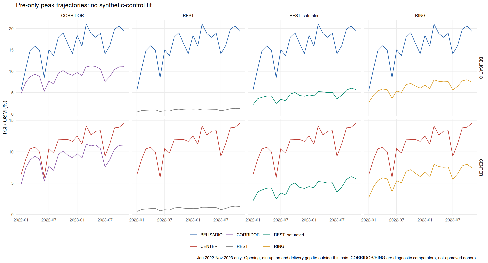

More donor cells do not create more independent pre-period months or eliminate spatial dependence. High correlation alone does not establish counterfactual validity, while level mismatch and held-out prediction error remain design concerns.

## Conditional speed denominators

| series | block | total_cells | min_jam_speed_cells | max_jam_speed_cells |
| --- | --- | --- | --- | --- |
| BELISARIO | Evening | 7.0000 | 7.0000 | 7.0000 |
| BELISARIO | Morning | 7.0000 | 7.0000 | 7.0000 |
| BELISARIO | Night | 7.0000 | 2.0000 | 7.0000 |
| CENTER | Evening | 7.0000 | 7.0000 | 7.0000 |
| CENTER | Morning | 7.0000 | 7.0000 | 7.0000 |
| CENTER | Night | 7.0000 | 1.0000 | 7.0000 |
| CORRIDOR | Evening | 34.0000 | 34.0000 | 34.0000 |
| CORRIDOR | Morning | 34.0000 | 34.0000 | 34.0000 |
| CORRIDOR | Night | 34.0000 | 10.0000 | 34.0000 |
| REST | Evening | 1533.0000 | 397.0000 | 996.0000 |
| REST | Morning | 1533.0000 | 511.0000 | 924.0000 |
| REST | Night | 1533.0000 | 173.0000 | 700.0000 |
| REST_saturated | Evening | 271.0000 | 209.0000 | 271.0000 |
| REST_saturated | Morning | 271.0000 | 242.0000 | 271.0000 |
| REST_saturated | Night | 271.0000 | 114.0000 | 271.0000 |
| RING | Evening | 56.0000 | 47.0000 | 56.0000 |
| RING | Morning | 56.0000 | 49.0000 | 56.0000 |
| RING | Night | 56.0000 | 13.0000 | 56.0000 |

## Numeric ledger and independent hostile-review audit

This ledger exposes numerical claims for reproducibility. The audit draws ten entries without replacement from this fixed ledger with seed 20260918, then recomputes them in a fresh R process from the deduplicated source blocks using independent DuckDB queries. It does not read the completed panel, group-series objects, or report-generation calculations. The accepted Phase B audit already checked original raw counts; this audit follows the author's new clean-block-only rule.

| metric | value |
| --- | --- |
| retained_cells | 1637.0000 |
| never_observed | 740.0000 |
| observed_no_pre | 92.0000 |
| rest_retained | 1533.0000 |
| saturated20 | 271.0000 |
| threshold12 | 555.0000 |
| center_cells | 7.0000 |
| belisario_cells | 7.0000 |
| corridor_cells | 34.0000 |
| ring_cells | 56.0000 |
| allroad_keys | 1314213.0000 |
| large_keys | 852218.0000 |
| negative_spread_keys | 2272.0000 |
| gap_negative_keys | 30.0000 |
| CENTER:202311:tci_osm_ratio | 14.5057 |
| CENTER:202311:presence | 1.0000 |
| CENTER:202311:tc_spread | 4184.2314 |
| BELISARIO:202311:tci_osm_ratio | 19.3555 |
| BELISARIO:202311:presence | 1.0000 |
| BELISARIO:202311:tc_spread | 5374.0847 |
| REST:202311:tci_osm_ratio | 1.2788 |
| REST:202311:presence | 0.4729 |
| REST:202311:tc_spread | 259.3478 |
| REST_saturated:202311:tci_osm_ratio | 5.7315 |
| REST_saturated:202311:presence | 0.9779 |
| REST_saturated:202311:tc_spread | 1222.1363 |

| metric | value | regenerated | absolute_difference | match |
| --- | --- | --- | --- | --- |
| retained_cells | 1637.0000 | 1637.0000 | 0.0000 | TRUE |
| center_cells | 7.0000 | 7.0000 | 0.0000 | TRUE |
| CENTER:202311:tc_spread | 4184.2314 | 4184.2314 | 0.0000 | TRUE |
| REST_saturated:202311:tci_osm_ratio | 5.7315 | 5.7315 | 0.0000 | TRUE |
| never_observed | 740.0000 | 740.0000 | 0.0000 | TRUE |
| REST:202311:tc_spread | 259.3478 | 259.3478 | 0.0000 | TRUE |
| REST_saturated:202311:tc_spread | 1222.1363 | 1222.1363 | 0.0000 | TRUE |
| gap_negative_keys | 30.0000 | 30.0000 | 0.0000 | TRUE |
| rest_retained | 1533.0000 | 1533.0000 | 0.0000 | TRUE |
| belisario_cells | 7.0000 | 7.0000 | 0.0000 | TRUE |

All ten regenerated values match at tolerance 1e-9 times max(1, absolute reported value). No mismatch remains. This is a spot audit, not proof against every aggregation error. Scripts also assert the missing-month mask and unique cleaned keys. No post-opening regression, ATT, event-study coefficient, synthetic-control fit or SDID fit was computed.
