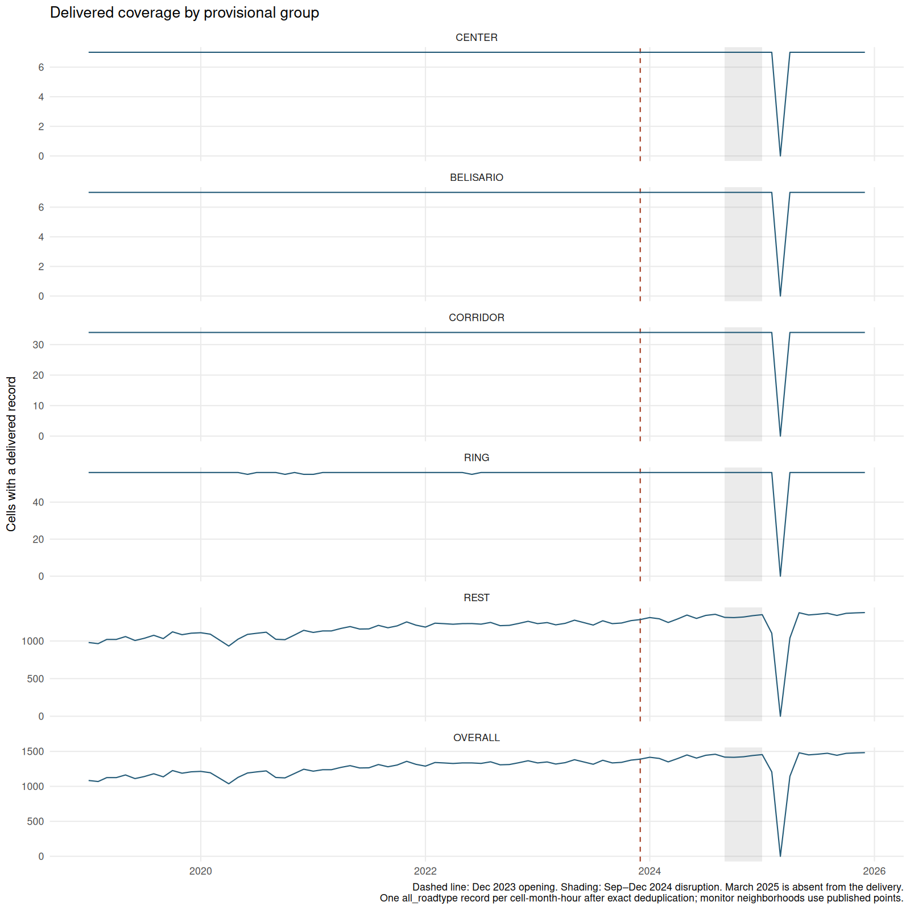
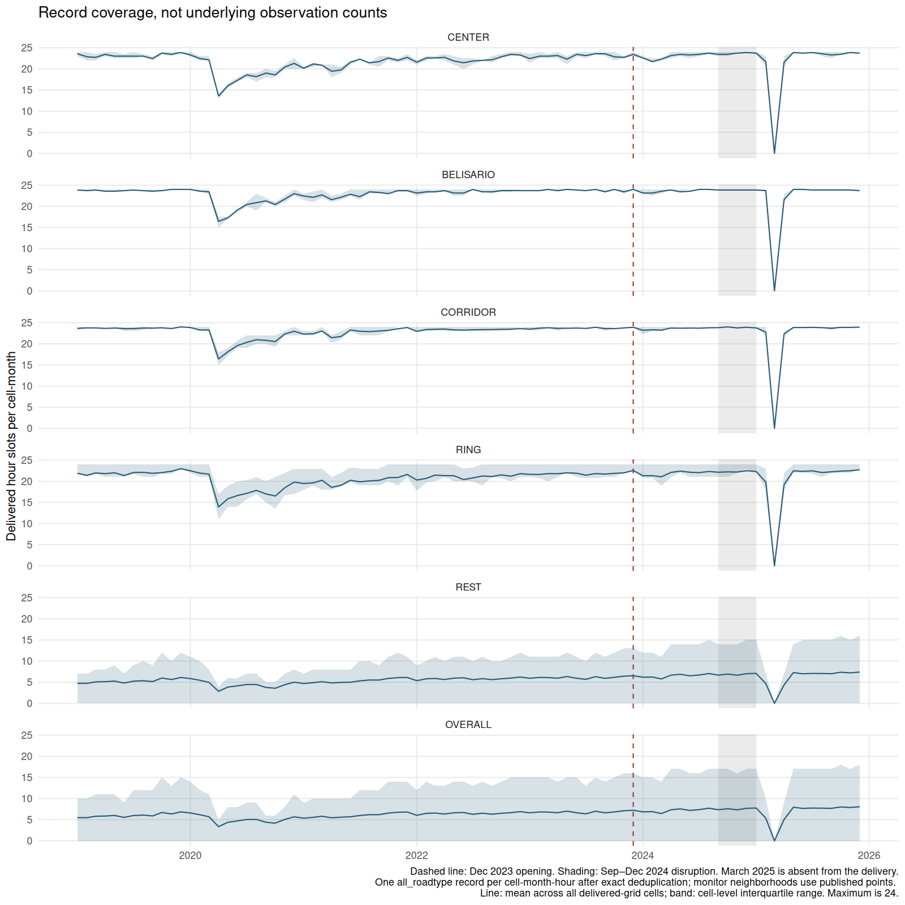
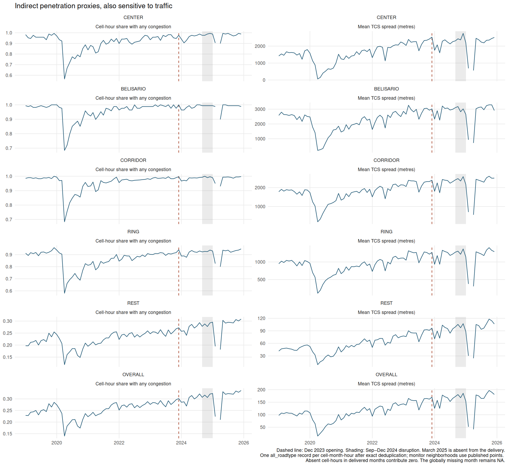
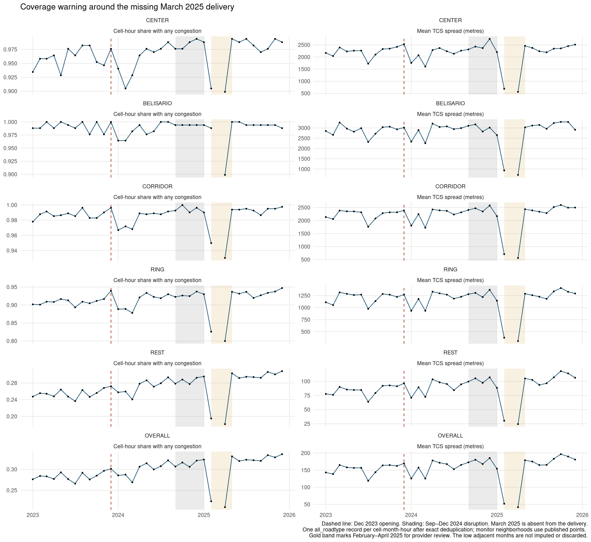

# Waze delivery inventory

Phase B. Generated 2026-09-17 by `Rscript Scripts/Congestion/01_inventory.R`. No treatment effect is estimated.

## Decisions carried forward

The authors accepted Phase A and fixed this module's monthly calendar: P1 is December 2023 through August 2024; disruption is all of September through December 2024; P2 is January through December 2025. The three future estimands correspond to P1, P1 plus P2, and the full window. Waze P2 is longer than the paper's P2. Morning bins are 7 and 8 and evening bins 17 and 18, pending author confirmation. The night bins used here are 22, 23, 0, 1, 2, 3, 4 and 5, inclusive of hour label 5. No weekday restriction is possible.

All cited paper estimates must come from the May 31 PDF, which postdates the CSV export. The paper CSVs are reserved for trajectories and donor weights. Phase A conflicts P1 and P3 remain author items and have not been investigated further. The present report does not cite CSV treatment estimates.

## Files and one-time format check

| File | Format | Bytes | Rows | Columns |
| --- | --- | --- | --- | --- |
| grids_polygons.csv | CSV / WKT | 761,250 | 2,469 | 2 |
| grids_quito_hourly_2019-2025.csv | CSV | 5,612,810,893 | 15,080,765 | 25 |
| grids_quito_hourly_2019-2025.parquet | Parquet | 939,414,511 | 15,080,765 | 24 |

The CSV and Parquet both contain 15,080,765 rows. A seeded sample of 256 physical rows agrees across all 24 substantive columns, with numerical tolerance 1e-12 times max(1, absolute reference value), identical character values and matching NA locations. The unnamed CSV index is a serialization field, not an extra analysis dimension. The largest sampled absolute numerical discrepancy is 0. The certificate records file sizes, modification times, sampled row indices and per-column discrepancies in `Output/Waze/inventory/csv_parquet_certificate.rds`. Subsequent runs reuse it unless an input fingerprint changes; all remaining computations read the Parquet.

## Row keys, duplicates and sparse coverage

The raw delivery contains 5,546,323 distinct cell-month-hour-roadtype keys and 9,534,442 additional duplicate rows. SELECT DISTINCT across every delivered column yields exactly the key count. Thus every repeated key has identical values in all delivered fields. The maximum multiplicity is 3. Exact deduplication is safe for this inventory and prevents repeated copies from changing group weights; the raw inputs remain untouched. Within all_roadtype, the monthly mean number of raw copies per distinct record ranges from 2.71163 to 2.72586. The source of the repeated copies is unknown.

| multiplicity | n_keys |
| --- | --- |
| 1 | 779102 |
| 3 | 4767221 |

| roadtype | distinct_rows | cells | n_months | raw_rows |
| --- | --- | --- | --- | --- |
| all_roadtype | 1314213 | 1729 | 83 | 3571869 |
| large | 852218 | 1667 | 83 | 2315636 |
| major_2_levels | 1078339 | 1716 | 83 | 2930565 |
| medium | 822561 | 1644 | 83 | 2231105 |
| minor_2_levels | 800036 | 1469 | 83 | 2179756 |
| small | 678956 | 1371 | 83 | 1851834 |

Across all roadtype blocks, the data cover 1,729 distinct cells, 83 observed months and 24 hour labels. The polygon grid contains 2,469 cells, leaving 740 with no delivered record in any month or roadtype. All IDs in the panel occur in the polygon reference. The hour labels span 0 through 23. There is no day-of-week dimension, flag_corr_type, observation count, jam count or direct road-length field.

The all_roadtype panel is sparse. It contains 1,314,213 distinct records against 4,918,248 possible cell-month-hour slots over the 83 months with any delivery, or 26.7212 percent. Every delivered record has positive TCI; a present row therefore identifies a cell-hour profile with observed congestion. There are 3,604,035 absent slots within delivered months. Under the authors' convention, these slots enter congestion aggregates as zero, including grid cells that never appear. This interpretation remains a substantive assumption about provider coverage, not proof of no traffic. Zero tci_osm_ratio values can coexist with positive TCI, so 'any congestion' is defined by tci > 0 rather than by the intensity ratio.

The full calendar has 4,977,504 cell-hour slots. 2025-03 is wholly absent across every cell, hour and roadtype. The completed lattice retains that month, but leaves congestion outcomes and penetration proxies NA there. Record-coverage counts are zero because nothing was delivered. Treating a citywide delivery gap as zero congestion would create an artificial collapse. This is an explicit exception to zero-filling sparse records within otherwise delivered months, and must remain in the memo. No missing month is interpolated.

Jam speed is conditional on jams. An absent congestion record does not imply jam_speed_ratio = 0, which would mean stopped traffic. Its value stays undefined for zero-congestion slots. Free-flow speed also stays missing where no value was delivered. Exact -998 and -999 sentinels become NA, and existing NA values stay NA. No flag filter can be applied because the field is absent. No trimming rule for other invalid values is silently imposed.

## Spatial validation and provisional groups

All 2469 polygon IDs have valid H3 syntax: 0 invalid, with resolutions 8. All 2469 delivered polygons pass sf validity checks. Reconstructing each boundary with DuckDB H3 in full-precision WKB and comparing in UTM 17S gives a maximum paired Hausdorff distance of 4.79993e-09 metres and maximum relative area error 5.89476e-12. All boundaries match at a 0.01 metre tolerance. This checks shape and location, without relying on vertex order. The observed grid bounds are longitude -78.629 to -78.2909 and latitude -0.459995 to 0.0600867. There are 2352 cell centers inside the requested box, 2469 polygon intersections, and 2236 polygons wholly within it. This is consistent with selecting intersecting cells, rather than strict center or full-polygon inclusion; the provider's exact selection rule is not confirmed. Keep the delivered extent and record these edge cells explicitly.

Station coordinates come from MetroStations.gpkg, with unused Z/M dimensions dropped in memory and its embedded CRS transformed correctly. Monitor points come from Distancia_REMMAQ_Metro.gpkg. These are the authors' copies from the air-quality repository; no source layer is edited. The Centro and Belisario coordinates are rounded to 0.01 degrees. The following seeds identify the published points, not verified physical monitor cells. Each neighborhood contains the seed and six H3 neighbors. A true single-monitor-cell option requires precise coordinates.

| group | Published-point seed (not a verified monitor cell) | grid_id |
| --- | --- | --- |
| CENTER | 8866d33885fffff | 8866d33881fffff |
| CENTER | 8866d33885fffff | 8866d33885fffff |
| CENTER | 8866d33885fffff | 8866d33887fffff |
| CENTER | 8866d33885fffff | 8866d3388dfffff |
| CENTER | 8866d33885fffff | 8866d338a9fffff |
| CENTER | 8866d33885fffff | 8866d338abfffff |
| CENTER | 8866d33885fffff | 8866d338e3fffff |
| BELISARIO | 8866d33aa3fffff | 8866d338c9fffff |
| BELISARIO | 8866d33aa3fffff | 8866d33aa1fffff |
| BELISARIO | 8866d33aa3fffff | 8866d33aa3fffff |
| BELISARIO | 8866d33aa3fffff | 8866d33aa7fffff |
| BELISARIO | 8866d33aa3fffff | 8866d33aabfffff |
| BELISARIO | 8866d33aa3fffff | 8866d33ab5fffff |
| BELISARIO | 8866d33aa3fffff | 8866d33abdfffff |

For consistent Phase B and Phase C labels, assign CENTER and BELISARIO first. Assign remaining cells with an H3 center within 1 km of any Line 1 station to CORRIDOR, then remaining cells within 2 km to RING, then REST. All distances use the H3 center and sf geodesic distance. Including San Francisco among the remaining corridor buffers prevents a cell near that station from entering REST after CENTER changes to the monitor neighborhood. The original 1 km San Francisco and Belisario-point buffers are retained as separate candidate flags in the spatial output. These descriptive labels do not lock the authors' final treated-unit definition.

| group | grid_cells | minimum_monthly_cells | maximum_monthly_cells | records_in_delivered_months | mean_slots_per_cell_month |
| --- | --- | --- | --- | --- | --- |
| BELISARIO | 7 | 7 | 7 | 13453 | 23.1549 |
| CENTER | 7 | 7 | 7 | 12904 | 22.21 |
| CORRIDOR | 34 | 34 | 34 | 65250 | 23.1219 |
| REST | 2365 | 933 | 1378 | 1124935 | 5.73084 |
| RING | 56 | 55 | 56 | 97671 | 21.0136 |

`Output/Waze/inventory/cell_groups.rds` stores all polygons, memberships, distance measures, original candidate buffers and validation results. The auxiliary cell_groups.csv is regenerated locally and ignored by git. Spatial groups are disjoint and exhaustive; RING is excluded from a future REST donor pool.

## Field dictionary and raw hygiene

The following definitions map the actual delivered names to `docs/waze_documentation.md`. The document describes source-window quantities that are then averaged into monthly hour profiles; a monthly TCI or TCS value must not be called a count of unique events over that entire month. Types below are DuckDB types. Ranges and percentages use all raw rows, including duplicate copies, to describe exactly what arrived. The non-sentinel range excludes only -998, -999 and NA. A percentage shown as 0 is exactly zero.

| column | type | meaning |
| --- | --- | --- |
| date | BIGINT | Month label YYYYMM, not an observation timestamp (provider section 7). |
| grid_id | VARCHAR | H3 resolution-8 cell identifier (section 3). |
| hour_of_day | BIGINT | Hour label 0 through 23, averaged over days in the month (section 7.1). |
| roadtype | VARCHAR | Stacked free-flow speed class or all-road aggregate (section 3.1). |
| avg_jam_speedkmh | DOUBLE | Mean speed during observed congestion, km/h; dictionary jam_speedkmh alias (section 5.2). |
| avg_jam_speed_ratio | DOUBLE | Delivered mean jam-speed/free-flow percentage; candidate jam_speed_ratio alias (section 5.3). |
| avg_freeflow | DOUBLE | Monthly segment free flow aggregated to the reporting unit, km/h (section 5.1). |
| tci | DOUBLE | Traffic congestion intensity: summed jam-line length over feed observations, metres times observations, then summarized (section 4.1). |
| tci_severe | DOUBLE | Severe TCI, documented as severe_tci. Severe-event definition conflicts between sections 6 and 9. |
| tci_osm_ratio | DOUBLE | Primary outcome: 100 times TCI divided by OSM road length and nominal feed observations (section 4.2). |
| tci_waze_ratio | DOUBLE | TCI percentage normalized by the annually observed Waze road network (section 4.2). |
| tci_severe_osm_ratio | DOUBLE | Secondary outcome: severe TCI percentage with the OSM denominator (section 6). |
| tci_severe_waze_ratio | DOUBLE | Severe TCI percentage with the Waze network denominator (section 6). |
| tc_spread | DOUBLE | TCS: length of segments congested at least once in the source window, metres, then summarized (section 4.3). |
| tc_severe_spread | DOUBLE | TCS restricted to severe events, metres (section 6). |
| tc_spread_osm_ratio | DOUBLE | 100 times TCS divided by OSM road length (section 4.4). |
| tc_spread_waze_ratio | DOUBLE | 100 times TCS divided by Waze road length (section 4.4). |
| tc_severe_spread_osm_ratio | DOUBLE | Severe TCS as a percentage of OSM road length (section 6). |
| tc_severe_spread_waze_ratio | DOUBLE | Severe TCS as a percentage of Waze road length (section 6). |
| tc_persistance_ratio | DOUBLE | TCP: 100 times TCI/TCS divided by nominal feed observations; delivered spelling retained (section 4.5). |
| tc_severe_persistance_ratio | DOUBLE | Severe TCP, nominally a percentage of the source window (section 6). |
| freeflow_speed | DOUBLE | Second delivered free-flow field, km/h; numerically compared with avg_freeflow below. |
| speed | DOUBLE | Constructed expected speed blending jam and free-flow speeds using congestion intensity, km/h (section 5.4). |
| t_speed_ratio | DOUBLE | Delivered speed percentage relative to free flow; documented speed_ratio alias (section 5.5). |

| column | raw_range | nonsentinel_range | NA_percent | sentinel_998_percent | sentinel_999_percent |
| --- | --- | --- | --- | --- | --- |
| date | 201901 to 202512 | 201901 to 202512 | 0 | 0 | 0 |
| grid_id | 8866d30095fffff to 888f2d936bfffff | 8866d30095fffff to 888f2d936bfffff | 0 | 0 | 0 |
| hour_of_day | 0 to 23 | 0 to 23 | 0 | 0 | 0 |
| roadtype | all_roadtype to small | all_roadtype to small | 0 | 0 | 0 |
| avg_jam_speedkmh | 0.0 to 68.53 | 0 to 68.53 | 0 | 0 | 0 |
| avg_jam_speed_ratio | 0.0 to 99.99973879142794 | 0 to 99.9997 | 0 | 0 | 0 |
| avg_freeflow | 10.044408086946357 to 129.87937915742808 | 10.0444 to 129.879 | 0 | 0 | 0 |
| tci | 0.00011913278639693204 to 95835.8422272005 | 0.000119133 to 95835.8 | 0 | 0 | 0 |
| tci_severe | 0.0 to 89802.73982120304 | 0 to 89802.7 | 0 | 0 | 0 |
| tci_osm_ratio | 0.0 to 88.26761904761906 | 0 to 88.2676 | 0 | 0 | 0 |
| tci_waze_ratio | -998.0 to 104.76190476190476 | -953.884 to 104.762 | 0.647434 | 0.00188982 | 0 |
| tci_severe_osm_ratio | 0.0 to 84.3691304347826 | 0 to 84.3691 | 0 | 0 | 0 |
| tci_severe_waze_ratio | -998.0 to 100.0 | -952.072 to 100 | 0.647434 | 0.000537108 | 0 |
| tc_spread | 0.00011913278639693204 to 12166.785962219232 | 0.000119133 to 12166.8 | 0 | 0 | 0 |
| tc_severe_spread | 0.0 to 11103.24047310202 | 0 to 11103.2 | 0 | 0 | 0 |
| tc_spread_osm_ratio | -570.2857142857143 to 103.52571428571429 | -570.286 to 103.526 | 0 | 0 | 0 |
| tc_spread_waze_ratio | -998.0 to 104.76190476190476 | -954.609 to 104.762 | 0.647434 | 0.00373986 | 0 |
| tc_severe_spread_osm_ratio | -99.8 to 100.0 | -99.8 to 100 | 0 | 0 | 0 |
| tc_severe_spread_waze_ratio | -998.0 to 101.85681818181818 | -954.609 to 101.857 | 0.647434 | 0.000716144 | 0 |
| tc_persistance_ratio | 8.333333333333325 to 100.00000000000004 | 8.33333 to 100 | 0 | 0 | 0 |
| tc_severe_persistance_ratio | 0.0 to 148793.1694181779 | 0 to 148793 | 0 | 0 | 0 |
| freeflow_speed | 10.044408086946357 to 129.87937915742808 | 10.0444 to 129.879 | 0 | 0 | 0 |
| speed | 8.560559292151254 to 129.7440899624025 | 8.56056 to 129.744 | 0 | 0 | 0 |
| t_speed_ratio | 28.224914208708334 to 100.0 | 28.2249 to 100 | 0 | 0 | 0 |

The polygon CSV has two nonmissing character columns: grid_id is the same H3 identifier and h3_geometry_r8 is WKT POLYGON geometry. Its spatial range and boundary checks appear above. The hourly CSV has one additional index column; it is excluded from the substantive dictionary.

The provider defines roadtype by segment free-flow speed: small <30 km/h, medium 30–50 inclusive, large >50, minor_2_levels <40, major_2_levels >40, and all_roadtype as the combined network. Exactly 40 km/h is omitted by the documented strict two-level split. Call large 'fast roads'. Never add stacked blocks together as though they were disjoint: they include two alternative partitions and the total.

The severe definition remains contradictory: section 6 uses Waze jam levels 3 and 4, while section 9 uses speed below 40 percent of free flow. The provider must confirm the operational definition. Free flow does not divide tci_osm_ratio, whose denominator is road length times nominal observations. It can affect jam detection, severe classification, speed ratios and roadtype assignment. The aggregated night reference can therefore matter without being the direct denominator of the primary outcome.

## Speed identities and invalid values

At the source-observation level, the documented formulas imply S = 100 - T + T J / 100, where S is speed_ratio, T is tci_osm_ratio and J is jam_speed_ratio, all measured in percent. In the delivered names this becomes t_speed_ratio = 100 - tci_osm_ratio + tci_osm_ratio * avg_jam_speed_ratio / 100. The numerical check below uses each distinct delivered row after sentinel recoding, without combining roadtypes. The ALL BLOCKS row pools residual diagnostics only; it is not a congestion aggregate.

| roadtype | n | within_1e8 | maximum_absolute_residual | mean_absolute_residual | median_absolute_residual | p99_absolute_residual | speed_freeflow_ratio_max_residual | freeflow_alias_max_difference |
| --- | --- | --- | --- | --- | --- | --- | --- | --- |
| ALL BLOCKS (rowwise only) | 5546323 | 1749251 | 4.17001777906702 | 0.0242254043286995 | 0.00243886346193278 | 0.338402677375643 | 1.4210854715202e-13 | 4.2632564145606e-14 |
| all_roadtype | 1314213 | 383512 | 4.17001777906702 | 0.0227232579175283 | 0.00252354917854802 | 0.30751447697223 | 1.4210854715202e-13 | 4.2632564145606e-14 |
| large | 852218 | 269203 | 3.87358408542568 | 0.033469409122566 | 0.00336351570630455 | 0.452564619242367 | 1.27897692436818e-13 | 4.2632564145606e-14 |
| major_2_levels | 1078339 | 354449 | 3.87358408542568 | 0.0303147473290822 | 0.0028379260521092 | 0.398723579167384 | 1.27897692436818e-13 | 4.2632564145606e-14 |
| medium | 822561 | 304243 | 2.78588903010964 | 0.0280506217717387 | 0.00187882577068876 | 0.386288122227447 | 1.4210854715202e-13 | 1.4210854715202e-14 |
| minor_2_levels | 800036 | 230951 | 2.38771609239222 | 0.0153602832539005 | 0.002344203000888 | 0.194482025011521 | 1.4210854715202e-13 | 1.4210854715202e-14 |
| small | 678956 | 206893 | 2.13695160750875 | 0.0116705382422226 | 0.00182979075433565 | 0.146807667308051 | 1.4210854715202e-13 | 1.06581410364015e-14 |

The claimed identity does not hold exactly in the delivered aggregates. Its largest absolute residual is 4.17002 percentage points overall and 4.17002 in all_roadtype; 383,512 of 1,314,213 all_roadtype rows pass tolerance 1e-8. Averaging a product need not equal multiplying averages, so upstream aggregation is a plausible explanation, but the supplied fields do not establish the cause. Keep the authors' three-outcome hierarchy and exclusion of speed_ratio; do not justify that exclusion by claiming exact redundancy in this delivered panel. The two free-flow fields differ by at most 4.26326e-14 km/h, consistent with floating-point aliases.

Some delivered percentages remain outside their conceptual bounds after exact sentinel recoding. Negative fractional values may reflect sentinel contamination before averaging, but this has not been confirmed. Severe persistence can greatly exceed 100. Preserve these records and ask the provider about the aggregation pipeline. The TCS penetration proxy below uses tc_spread in metres, which is nonnegative, rather than the contaminated OSM spread percentage.

| column | n_negative_nonsentinel | n_nonfinite | nonsentinel_range |
| --- | --- | --- | --- |
| tci_waze_ratio | 19116 | 0 | -953.884 to 104.762 |
| tci_severe_waze_ratio | 9543 | 0 | -952.072 to 100 |
| tc_spread_osm_ratio | 17599 | 0 | -570.286 to 103.526 |
| tc_spread_waze_ratio | 119014 | 0 | -954.609 to 104.762 |
| tc_severe_spread_osm_ratio | 2719 | 0 | -99.8 to 100 |
| tc_severe_spread_waze_ratio | 49079 | 0 | -954.609 to 101.857 |
| tc_severe_persistance_ratio | 0 | 0 | 0 to 148793 |

| roadtype | n | nonpositive_tci | zero_tci_ratio | negative_spread_ratio | spread_ratio_over_100 | severe_persistence_over_100 | severe_over_total | negative_waze_ratio |
| --- | --- | --- | --- | --- | --- | --- | --- | --- |
| all_roadtype | 1314213 | 0 | 1315 | 2272 | 0 | 4685 | 0 | 782 |
| large | 852218 | 0 | 348 | 1474 | 1 | 7114 | 0 | 2912 |
| major_2_levels | 1078339 | 0 | 600 | 2149 | 0 | 6495 | 0 | 931 |
| medium | 822561 | 0 | 548 | 744 | 3 | 1274 | 0 | 906 |
| minor_2_levels | 800036 | 0 | 816 | 139 | 0 | 689 | 0 | 653 |
| small | 678956 | 0 | 647 | 79 | 0 | 460 | 0 | 638 |

## Coverage and indirect penetration proxies

All summaries in this section select only all_roadtype and use the completed cell-month-hour lattice. Record counts measure delivered monthly hour profiles, not underlying Waze observations, users, vehicles or jam events. Direct counts and flags were not supplied, and counts have been requested. Both the share of cell-hours with any congestion and mean TCS spread can change because of actual traffic as well as reporting penetration. Neither isolates penetration.

Coverage and TCS drop together in February and April 2025 around the wholly missing March month. The pattern occurs across groups, so provider completeness for the whole February–April interval needs review. These adjacent months remain as delivered; partial coverage is a hypothesis, not a confirmed cause. Do not treat this dip as evidence about the metro. CENTER and BELISARIO have much denser hour-profile coverage than REST, making uniform penetration assumptions questionable even when their time trends look similar. The figures show levels and raw trajectories only.

The cell-hour share is the number of completed slots with tci > 0 divided by all grid cells times 24 in a delivered month. It is a profile-coverage measure, not the fraction of underlying hourly timestamps that were congested. Mean TCS uses tc_spread with absent slots zero-filled within delivered months and equal cell-hour weights. No road-length weighting is possible from a directly supplied road-length field. The next table pools the monthly descriptive proxies within each year, excluding the missing delivery month. These are raw summaries, not pre/post effects.

| year | group | delivered_months | mean_any_congestion_share | mean_TCS_metres |
| --- | --- | --- | --- | --- |
| 2019 | BELISARIO | 12 | 0.990079 | 2542.39 |
| 2019 | CENTER | 12 | 0.965278 | 1558.24 |
| 2019 | OVERALL | 12 | 0.250121 | 105.219 |
| 2019 | REST | 12 | 0.219421 | 48.2782 |
| 2020 | BELISARIO | 12 | 0.873512 | 1217.1 |
| 2020 | CENTER | 12 | 0.801091 | 772.031 |
| 2020 | OVERALL | 12 | 0.209457 | 62.4264 |
| 2020 | REST | 12 | 0.183071 | 31.3197 |
| 2021 | BELISARIO | 12 | 0.948909 | 1994.59 |
| 2021 | CENTER | 12 | 0.887401 | 1516.4 |
| 2021 | OVERALL | 12 | 0.249826 | 107.228 |
| 2021 | REST | 12 | 0.22192 | 56.7085 |
| 2022 | BELISARIO | 12 | 0.979167 | 2393.73 |
| 2022 | CENTER | 12 | 0.931548 | 1854.53 |
| 2022 | OVERALL | 12 | 0.270739 | 126.383 |
| 2022 | REST | 12 | 0.242172 | 68.0595 |
| 2023 | BELISARIO | 12 | 0.991567 | 2887.66 |
| 2023 | CENTER | 12 | 0.960317 | 2233.97 |
| 2023 | OVERALL | 12 | 0.283836 | 153.524 |
| 2023 | REST | 12 | 0.254783 | 84.5634 |
| 2024 | BELISARIO | 12 | 0.986607 | 2907.38 |
| 2024 | CENTER | 12 | 0.965278 | 2215.81 |
| 2024 | OVERALL | 12 | 0.303377 | 162.597 |
| 2024 | REST | 12 | 0.275075 | 93.1969 |
| 2025 | BELISARIO | 11 | 0.98539 | 2662.84 |
| 2025 | CENTER | 11 | 0.970779 | 2034.71 |
| 2025 | OVERALL | 11 | 0.30639 | 153.043 |
| 2025 | REST | 11 | 0.278351 | 89.6752 |

Each entry below is cells with any delivered record / mean delivered hour slots per grid cell. Means include cells with zero records. The missing month's zero record counts describe the delivery, not traffic. The full cell-month distribution, including every cell's count and group, is saved in cell_month_coverage.rds; monthly means, quartiles, maxima, proxy values and denominators are in monthly_coverage.rds, all under Output/Waze/inventory/.

| date | CENTER | BELISARIO | CORRIDOR | RING | REST | OVERALL |
| --- | --- | --- | --- | --- | --- | --- |
| 2019-01 | 7 / 23.571 | 7 / 23.857 | 34 / 23.647 | 56 / 21.875 | 980 / 4.732 | 1084 / 5.489 |
| 2019-02 | 7 / 22.857 | 7 / 23.714 | 34 / 23.765 | 56 / 21.429 | 965 / 4.729 | 1069 / 5.475 |
| 2019-03 | 7 / 22.714 | 7 / 23.857 | 34 / 23.765 | 56 / 21.982 | 1021 / 5.073 | 1125 / 5.817 |
| 2019-04 | 7 / 23.429 | 7 / 23.571 | 34 / 23.647 | 56 / 21.804 | 1021 / 5.122 | 1125 / 5.860 |
| 2019-05 | 7 / 23.000 | 7 / 23.571 | 34 / 23.735 | 56 / 22.018 | 1059 / 5.264 | 1163 / 6.000 |
| 2019-06 | 7 / 23.000 | 7 / 23.714 | 34 / 23.588 | 56 / 21.375 | 1007 / 4.806 | 1111 / 5.546 |
| 2019-07 | 7 / 23.000 | 7 / 23.857 | 34 / 23.588 | 56 / 22.071 | 1036 / 5.241 | 1140 / 5.979 |
| 2019-08 | 7 / 23.000 | 7 / 23.714 | 34 / 23.735 | 56 / 22.125 | 1076 / 5.350 | 1180 / 6.086 |
| 2019-09 | 7 / 22.429 | 7 / 23.571 | 34 / 23.706 | 56 / 21.893 | 1032 / 5.148 | 1136 / 5.885 |
| 2019-10 | 7 / 23.714 | 7 / 23.714 | 34 / 23.794 | 56 / 22.071 | 1122 / 5.989 | 1226 / 6.699 |
| 2019-11 | 7 / 23.429 | 7 / 24.000 | 34 / 23.618 | 56 / 22.375 | 1084 / 5.626 | 1188 / 6.356 |
| 2019-12 | 7 / 23.857 | 7 / 24.000 | 34 / 24.000 | 56 / 22.982 | 1104 / 6.113 | 1208 / 6.843 |
| 2020-01 | 7 / 23.286 | 7 / 24.000 | 34 / 23.853 | 56 / 22.500 | 1110 / 5.860 | 1214 / 6.586 |
| 2020-02 | 7 / 22.429 | 7 / 23.571 | 34 / 23.265 | 56 / 21.929 | 1091 / 5.447 | 1195 / 6.166 |
| 2020-03 | 7 / 22.143 | 7 / 23.429 | 34 / 23.294 | 56 / 21.696 | 1015 / 4.964 | 1119 / 5.697 |
| 2020-04 | 7 / 13.571 | 7 / 16.429 | 34 / 16.412 | 56 / 13.929 | 933 / 2.848 | 1037 / 3.355 |
| 2020-05 | 7 / 16.000 | 7 / 17.286 | 34 / 18.118 | 56 / 15.875 | 1024 / 3.843 | 1128 / 4.385 |
| 2020-06 | 7 / 17.286 | 7 / 19.143 | 34 / 19.588 | 55 / 16.625 | 1088 / 4.129 | 1191 / 4.705 |
| 2020-07 | 7 / 18.571 | 7 / 20.429 | 34 / 20.353 | 56 / 17.143 | 1103 / 4.449 | 1207 / 5.041 |
| 2020-08 | 7 / 18.143 | 7 / 20.857 | 34 / 20.971 | 56 / 17.857 | 1117 / 4.452 | 1221 / 5.069 |
| 2020-09 | 7 / 19.000 | 7 / 21.286 | 34 / 20.824 | 56 / 17.018 | 1023 / 3.762 | 1127 / 4.390 |
| 2020-10 | 7 / 18.571 | 7 / 20.429 | 34 / 20.529 | 55 / 16.518 | 1018 / 3.564 | 1121 / 4.182 |
| 2020-11 | 7 / 20.429 | 7 / 21.714 | 34 / 22.324 | 56 / 18.482 | 1080 / 4.406 | 1184 / 5.067 |
| 2020-12 | 7 / 21.286 | 7 / 23.000 | 34 / 22.971 | 55 / 19.804 | 1142 / 4.999 | 1245 / 5.679 |
| 2021-01 | 7 / 20.143 | 7 / 22.429 | 34 / 22.294 | 55 / 19.482 | 1114 / 4.684 | 1217 / 5.356 |
| 2021-02 | 7 / 21.143 | 7 / 22.143 | 34 / 22.382 | 56 / 19.625 | 1134 / 4.889 | 1238 / 5.559 |
| 2021-03 | 7 / 20.857 | 7 / 22.714 | 34 / 23.029 | 56 / 20.250 | 1134 / 5.124 | 1238 / 5.808 |
| 2021-04 | 7 / 19.429 | 7 / 21.571 | 34 / 21.441 | 56 / 18.571 | 1167 / 4.823 | 1271 / 5.452 |
| 2021-05 | 7 / 19.714 | 7 / 22.143 | 34 / 21.735 | 56 / 19.054 | 1192 / 4.950 | 1296 / 5.592 |
| 2021-06 | 7 / 21.571 | 7 / 22.857 | 34 / 23.265 | 56 / 20.250 | 1159 / 4.992 | 1263 / 5.687 |
| 2021-07 | 7 / 22.286 | 7 / 22.286 | 34 / 22.971 | 56 / 19.875 | 1161 / 5.319 | 1265 / 5.988 |
| 2021-08 | 7 / 21.429 | 7 / 23.429 | 34 / 22.882 | 56 / 20.089 | 1208 / 5.515 | 1312 / 6.181 |
| 2021-09 | 7 / 21.714 | 7 / 23.286 | 34 / 23.029 | 56 / 20.232 | 1176 / 5.515 | 1280 / 6.186 |
| 2021-10 | 7 / 22.571 | 7 / 23.000 | 34 / 23.176 | 56 / 20.857 | 1201 / 5.891 | 1305 / 6.565 |
| 2021-11 | 7 / 22.000 | 7 / 23.714 | 34 / 23.559 | 56 / 20.893 | 1254 / 6.084 | 1358 / 6.756 |
| 2021-12 | 7 / 22.714 | 7 / 23.714 | 34 / 23.853 | 56 / 21.625 | 1211 / 6.126 | 1315 / 6.819 |
| 2022-01 | 7 / 21.571 | 7 / 23.143 | 34 / 22.941 | 56 / 20.304 | 1185 / 5.361 | 1289 / 6.038 |
| 2022-02 | 7 / 22.571 | 7 / 23.429 | 34 / 23.382 | 56 / 20.696 | 1237 / 5.814 | 1341 / 6.491 |
| 2022-03 | 7 / 22.571 | 7 / 23.429 | 34 / 23.441 | 56 / 21.464 | 1231 / 5.880 | 1335 / 6.573 |
| 2022-04 | 7 / 22.714 | 7 / 23.714 | 34 / 23.500 | 56 / 21.339 | 1223 / 5.643 | 1327 / 6.345 |
| 2022-05 | 7 / 21.857 | 7 / 23.143 | 34 / 23.294 | 56 / 21.321 | 1231 / 5.958 | 1335 / 6.639 |
| 2022-06 | 7 / 21.429 | 7 / 23.143 | 34 / 23.235 | 55 / 20.411 | 1232 / 6.040 | 1335 / 6.695 |
| 2022-07 | 7 / 21.857 | 7 / 24.000 | 34 / 23.324 | 56 / 20.804 | 1224 / 5.593 | 1328 / 6.280 |
| 2022-08 | 7 / 22.000 | 7 / 23.429 | 34 / 23.353 | 56 / 21.250 | 1247 / 5.843 | 1351 / 6.529 |
| 2022-09 | 7 / 22.143 | 7 / 23.429 | 34 / 23.382 | 56 / 21.143 | 1204 / 5.608 | 1308 / 6.302 |
| 2022-10 | 7 / 22.857 | 7 / 23.714 | 34 / 23.441 | 56 / 21.518 | 1208 / 5.814 | 1312 / 6.512 |
| 2022-11 | 7 / 23.429 | 7 / 23.714 | 34 / 23.471 | 56 / 21.214 | 1234 / 5.971 | 1338 / 6.658 |
| 2022-12 | 7 / 23.286 | 7 / 23.714 | 34 / 23.588 | 56 / 21.804 | 1262 / 6.220 | 1366 / 6.910 |
| 2023-01 | 7 / 22.429 | 7 / 23.714 | 34 / 23.471 | 56 / 21.643 | 1231 / 5.934 | 1335 / 6.629 |
| 2023-02 | 7 / 23.000 | 7 / 23.714 | 34 / 23.706 | 56 / 21.625 | 1245 / 6.129 | 1349 / 6.820 |
| 2023-03 | 7 / 23.000 | 7 / 24.000 | 34 / 23.794 | 56 / 21.821 | 1215 / 6.097 | 1319 / 6.796 |
| 2023-04 | 7 / 23.143 | 7 / 23.714 | 34 / 23.647 | 56 / 21.804 | 1235 / 5.945 | 1339 / 6.648 |
| 2023-05 | 7 / 22.286 | 7 / 24.000 | 34 / 23.676 | 56 / 22.000 | 1277 / 6.337 | 1381 / 7.027 |
| 2023-06 | 7 / 23.429 | 7 / 23.857 | 34 / 23.735 | 56 / 21.911 | 1244 / 5.934 | 1348 / 6.642 |
| 2023-07 | 7 / 23.143 | 7 / 23.714 | 34 / 23.647 | 56 / 21.446 | 1212 / 5.674 | 1316 / 6.380 |
| 2023-08 | 7 / 23.571 | 7 / 24.000 | 34 / 23.912 | 56 / 21.821 | 1269 / 6.312 | 1373 / 7.005 |
| 2023-09 | 7 / 23.571 | 7 / 23.429 | 34 / 23.588 | 56 / 21.714 | 1231 / 5.916 | 1335 / 6.618 |
| 2023-10 | 7 / 22.857 | 7 / 24.000 | 34 / 23.588 | 56 / 21.875 | 1239 / 6.142 | 1343 / 6.838 |
| 2023-11 | 7 / 22.714 | 7 / 23.429 | 34 / 23.765 | 56 / 22.000 | 1271 / 6.429 | 1375 / 7.115 |
| 2023-12 | 7 / 23.429 | 7 / 24.000 | 34 / 23.912 | 56 / 22.554 | 1285 / 6.529 | 1389 / 7.229 |
| 2024-01 | 7 / 22.571 | 7 / 23.143 | 34 / 23.206 | 56 / 21.321 | 1312 / 6.178 | 1416 / 6.851 |
| 2024-02 | 7 / 21.714 | 7 / 23.143 | 34 / 23.324 | 56 / 21.339 | 1295 / 6.225 | 1399 / 6.895 |
| 2024-03 | 7 / 22.286 | 7 / 23.571 | 34 / 23.235 | 56 / 21.071 | 1246 / 5.772 | 1350 / 6.457 |
| 2024-04 | 7 / 23.143 | 7 / 23.857 | 34 / 23.735 | 56 / 22.107 | 1294 / 6.669 | 1398 / 7.350 |
| 2024-05 | 7 / 23.429 | 7 / 23.429 | 34 / 23.706 | 56 / 22.411 | 1345 / 6.869 | 1449 / 7.547 |
| 2024-06 | 7 / 23.286 | 7 / 23.571 | 34 / 23.735 | 56 / 22.143 | 1300 / 6.504 | 1404 / 7.192 |
| 2024-07 | 7 / 23.429 | 7 / 24.000 | 34 / 23.706 | 56 / 22.054 | 1340 / 6.701 | 1444 / 7.380 |
| 2024-08 | 7 / 23.714 | 7 / 24.000 | 34 / 23.794 | 56 / 22.321 | 1355 / 7.041 | 1459 / 7.714 |
| 2024-09 | 7 / 23.429 | 7 / 23.857 | 34 / 23.824 | 56 / 22.143 | 1314 / 6.674 | 1418 / 7.358 |
| 2024-10 | 7 / 23.429 | 7 / 23.857 | 34 / 24.000 | 56 / 22.232 | 1311 / 6.914 | 1415 / 7.591 |
| 2024-11 | 7 / 23.714 | 7 / 23.857 | 34 / 23.765 | 56 / 22.196 | 1319 / 6.655 | 1423 / 7.340 |
| 2024-12 | 7 / 23.857 | 7 / 23.857 | 34 / 23.912 | 56 / 22.500 | 1337 / 7.018 | 1441 / 7.697 |
| 2025-01 | 7 / 23.714 | 7 / 23.857 | 34 / 23.765 | 56 / 22.321 | 1350 / 7.088 | 1454 / 7.758 |
| 2025-02 | 7 / 21.714 | 7 / 23.714 | 34 / 22.794 | 56 / 19.821 | 1103 / 4.674 | 1207 / 5.370 |
| 2025-03 | 0 / 0.000 | 0 / 0.000 | 0 / 0.000 | 0 / 0.000 | 0 / 0.000 | 0 / 0.000 |
| 2025-04 | 7 / 21.571 | 7 / 21.571 | 34 / 22.324 | 56 / 19.196 | 1040 / 4.353 | 1144 / 5.035 |
| 2025-05 | 7 / 23.857 | 7 / 24.000 | 34 / 23.853 | 56 / 22.482 | 1376 / 7.272 | 1480 / 7.940 |
| 2025-06 | 7 / 23.714 | 7 / 24.000 | 34 / 23.853 | 56 / 22.357 | 1346 / 6.997 | 1450 / 7.673 |
| 2025-07 | 7 / 23.857 | 7 / 23.857 | 34 / 23.882 | 56 / 22.482 | 1356 / 7.072 | 1460 / 7.748 |
| 2025-08 | 7 / 23.571 | 7 / 23.857 | 34 / 23.824 | 56 / 22.071 | 1369 / 7.054 | 1473 / 7.720 |
| 2025-09 | 7 / 23.286 | 7 / 23.857 | 34 / 23.676 | 56 / 22.250 | 1340 / 7.014 | 1444 / 7.683 |
| 2025-10 | 7 / 23.429 | 7 / 23.857 | 34 / 23.882 | 56 / 22.411 | 1368 / 7.351 | 1472 / 8.012 |
| 2025-11 | 7 / 23.857 | 7 / 23.857 | 34 / 23.882 | 56 / 22.500 | 1374 / 7.213 | 1478 / 7.883 |
| 2025-12 | 7 / 23.714 | 7 / 23.714 | 34 / 23.941 | 56 / 22.732 | 1378 / 7.397 | 1482 / 8.066 |

## Delivery versus the July 2026 request

| Requested | Delivered |
| --- | --- |
| Geography | 2469 grid polygons; 117 centers outside requested box; 2469 polygons intersect it. H3 checks below. |
| Frequency | Monthly profiles by hour of day; no weekly or individual-day dimension. |
| Weekday peak aggregation | No day-of-week dimension. Use morning bins 7,8 and evening bins 17,18 over all days; weekdays cannot be isolated. |
| All-hours/all-days aggregation | 24 hourly labels permit all-hours summaries after completion; no separate daily or day-of-week records. |
| Start and end | January 2019 through December 2025, with missing 2025-03 and sparse cell-hour coverage. |
| Indicator suite | TCI, severe TCI, TCS, severe TCS, OSM/Waze ratios, TCP, severe TCP, jam speeds and constructed speeds are present with naming aliases. |
| Free-flow diagnostics | Two near-identical aggregated free-flow columns; no segment-level night observations or road-length series. |
| Underlying observation and jam counts | Not delivered. Counts have been requested; use indirect proxies only. |
| Quality flags | flag_corr_type is absent. Provider says summarized tables filter upstream, which cannot be verified here. |
| Road classes | Six stacked free-flow speed classes, including all_roadtype; large is fast roads, not a functional class. |
| Raw CSV and Parquet equivalence | Full row counts and a seeded 256-row, all-field value comparison pass; the CSV has an additional serialized row index. |

## Review sample and reproducibility

`reports/waze_sample.csv` contains exactly 500 distinct observed rows with all original fields, plus group, period, hour_block and raw_multiplicity. Missing values are written as NA; source sentinels remain visible in this review artifact. One deterministic hash-ranked row is drawn from each available group-by-roadtype-by-period-by-hour-block stratum (480 strata), then the remaining rows are drawn by the same stable hash order to reach 500. The hash includes seed 20260917; DuckDB's version is recorded in the saved session. This is a coverage-oriented review sample, not a probability sample for analysis. All six roadtypes, all five groups, pre-opening and post-opening periods, peaks and off-peaks are represented.

| group | rows | roadtypes | months | earliest_month | latest_month |
| --- | --- | --- | --- | --- | --- |
| BELISARIO | 96 | 6 | 40 | 201905 | 202512 |
| CENTER | 96 | 6 | 42 | 201901 | 202512 |
| CORRIDOR | 98 | 6 | 40 | 201901 | 202512 |
| REST | 114 | 6 | 53 | 201901 | 202512 |
| RING | 96 | 6 | 43 | 201904 | 202512 |

Run `Rscript Scripts/Congestion/01_inventory.R` from the repository root. It creates the inventory, spatial metadata, coverage outputs, plots and review sample, then starts the independent audit in a fresh R process. The first run validates the CSV; later runs use its fingerprinted certificate. `01_audit_inventory.R` can also run by itself. No R package installation, model fit, ATT, event study, post-indicator regression, synthetic control or SDID fit occurs. Data/ and the frozen air-quality inputs are never written or committed. Only the review sample is exempt from the general generated-CSV ignore rule.

## Explicit numeric checks eligible for the random audit

These raw-source checks provide the declared sampling pool for the independent ten-number audit. Values use enough digits to reproduce the stored result. The audit draws ten uniformly without replacement with seed 9172026 and does not use the inventory's derived tables to recompute them.

| id | value |
| --- | --- |
| raw_rows | 15080765 |
| distinct_rows | 5546323 |
| extra_duplicate_rows | 9534442 |
| grid_cells | 2469 |
| observed_cells | 1729 |
| unobserved_grid_cells | 740 |
| observed_months | 83 |
| hour_labels | 24 |
| raw_allroad_rows | 3571869 |
| distinct_allroad_rows | 1314213 |
| allroad_absent_delivered_slots | 3604035 |
| max_key_multiplicity | 3 |
| raw_primary_max | 88.267619047619064 |
| distinct_primary_zero | 4274 |
| raw_waze_tci_na | 97638 |
| raw_waze_tci_sentinel | 285 |
| raw_spread_negative | 17599 |
| raw_severe_persistence_max | 148793.16941817789 |
| identity_max | 4.1700177790670239 |
| freeflow_alias_max | 4.2632564145606011e-14 |
| invalid_grid_h3 | 0 |
| grid_centers_outside_box | 117 |
| first_month | 201901 |
| last_month | 202512 |

## Items to carry into the strategy memo

Keep author conflicts P1 and P3 unresolved. Record the deliberate monthly calendar and longer Waze P2, uncertain monitor locations, all-day peak profiles, missing March 2025, exact duplicated records, incomplete cell-hour coverage, the lack of direct observation/flag fields, invalid auxiliary ratios, failure of the delivered speed identity, the ambiguous severe threshold, and the speed-based meaning of fast roads. Coordinate precision conditions the single-cell option; no physical monitor cell is claimed. Boundary-box discrepancies, if any, are quantified above and must be described as delivered rather than silently recut.

<!-- INVENTORY_AUDIT_START -->
## Independent ten-number audit

A fresh R process drew ten checks uniformly without replacement from the 24 numeric checks listed above, using seed 9172026. Each value was read from the report text and independently recomputed from the raw Parquet or raw polygon CSV with separate SQL. The audit did not use the deduplicated inventory table, saved group table or coverage summaries. It never reopened the hourly CSV. Numerical matches use tolerance 1e-10 times max(1, absolute report value).

| check | report_value | raw_recomputed | difference | result |
| --- | --- | --- | --- | --- |
| freeflow_alias_max | 4.2632564145606011e-14 | 4.2632564145606011e-14 | 0 | MATCH |
| raw_severe_persistence_max | 148793.16941817789 | 148793.16941817789 | 0 | MATCH |
| distinct_allroad_rows | 1314213 | 1314213 | 0 | MATCH |
| raw_rows | 15080765 | 15080765 | 0 | MATCH |
| observed_months | 83 | 83 | 0 | MATCH |
| distinct_rows | 5546323 | 5546323 | 0 | MATCH |
| hour_labels | 24 | 24 | 0 | MATCH |
| observed_cells | 1729 | 1729 | 0 | MATCH |
| extra_duplicate_rows | 9534442 | 9534442 | 0 | MATCH |
| distinct_primary_zero | 4274 | 4274 | 0 | MATCH |

Matches: 10. Mismatches: 0. The draw, independent queries and results are saved in Output/Waze/inventory/independent_audit.rds.
